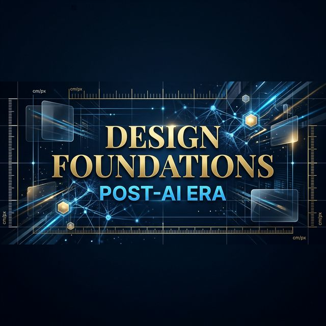

# Design-Foundations-PostAI 🎨🤖

**"AI bir görüntü oluşturabilir ama bir tasarımı yalnızca bir tasarımcı inşa eder."**

Bu depo, yapay zekanın (Midjourney, DALL-E, Firefly) görsel üretimini domine ettiği bir çağda, grafik tasarımın değişmez teknik temellerini ve görsel okuryazarlığı korumak için oluşturulmuş kapsamlı bir rehberdir. 

Post-AI döneminde bir "prompt mühendisi" ile gerçek bir "tasarımcı" arasındaki fark; **Kerning**, **Leading**, **Gamut** ve **Raster** gibi teknik parametrelerin estetik ve işlevsel sonuçlarını bilmekten geçer.

---

## 📌 İçindekiler
1. [Neden Post-AI Tasarım Temelleri?](#-neden-post-ai-tasarım-temelleri)
2. [Tipografinin Görsel Ritmi](#-tipografinin-görsel-ritmi)
3. [Renk Uzayları ve Dijital Gerçeklik](#-renk-uzayları-ve-dijital-gerçeklik)
4. [İmaj Anatomisi: Raster vs. Vektör](#-imaj-anatomisi-raster-vs-vektör)
5. [Tasarım Psikolojisi ve Semiyotik](#-tasarım-psikolojisi-ve-semiyotik)
6. [Baskı Teknolojileri ve Tarihsel Kökenler](#-baskı-teknolojileri-ve-tarihsel-kökenler)
7. [AI Araçları ile Teknik Denetim](#-ai-araçları-ile-teknik-denetim)

---

## 🚀 Neden Post-AI Tasarım Temelleri?

Günümüzde AI, saniyeler içinde estetik görseller üretebiliyor. Ancak profesyonel bir üretim sürecinde şu sorunlar hala tasarımcı müdahalesi gerektiriyor:
- **Teknik Hatalar:** AI'nın metinlerdeki harf boşluklarını (Kerning) rastgele kurgulaması.
- **Baskı Uyumsuzluğu:** Dijitalde parlak duran bir rengin matbaada (CMYK) çamura dönüşmesi.
- **Ölçeklenebilirlik:** AI çıktılarının (Raster) büyük boyutlu baskılarda pikselleşmesi.

Bu rehber, üretken yapay zekayı bir "çırak" gibi kullanıp, "usta" kararlarını vermenizi sağlar.

---

## ✍️ Tipografinin Görsel Ritmi

Yapay zeka metin oluşturmayı öğreniyor olsa da, tipografik hiyerarşi ve boşluk yönetimi hala insan gözünün hassasiyetine ihtiyaç duyar.

- **Leading (Satır Arası Boşluk):** Metnin nefes almasını sağlar. Standart olarak font boyutunun %120-%145'i arası tercih edilir (12pt font için 14.4pt gibi).
- **Kerning (Harf Çifti Boşluğu):** "V" ve "A" gibi harfler arasındaki optik boşluğu manuel olarak dengelemek, kurumsal bir logonun amatörce görünmesini engeller. 
- **Tracking:** Bir metin bloğunun genel harf yayılımıdır. Özellikle büyük harf (ALL CAPS) kullanımlarında pozitif tracking (+20 to +50) okunabilirliği artırır.
- **Optical Sizing (Optik Boyutlandırma):** Modern variable fontlarda (Değişken Fontlar) bulunan bu teknik, fontun küçük boyutlarda gövdesinin kalınlaşmasını, büyük boyutlarda ise detaylarının incelmesini sağlar. AI tasarımlarında bu "dinamik denge" manuel olarak kontrol edilmelidir.
- **Hinting:** Ekranlardaki piksellerin harf formlarına tam oturması için yapılan dijital işlem. AI çıktılarını vektöre çevirirken fontun 'hinting' verisini kaybetmemek, düşük çözünürlüklü ekranlarda netlik için kritiktir.

---

## 🌈 Renk Uzayları ve Dijital Gerçeklik

AI her zaman en canlı rengi seçer, ancak bu renk her zaman "gerçek" değildir.

- **Gamut (Renk Yelpazesi):** Bir ekranın veya yazıcının üretebildiği renk sınırıdır.
- **Bit Depth (Renk Derinliği):** 8-bit (16.7 milyon renk) vs 16-bit. Post-AI süreçlerinde gradiyen geçişlerindeki "banding" (şeritlenme) sorununu çözmek için 16-bit işleme kritik önem taşır.
- **ICC Profilleri:** Tasarımın ekran, matbaa ve web arasında tutarlı görünmesini sağlayan renk pasaportları.
- **Delta E (ΔE):** İki renk arasındaki matematiksel fark. ΔE < 2.0 değeri, insan gözünün fark edemeyeceği kadar hassas bir renk doğruluğunu temsil eder; profesyonel baskı denetiminde bu standart hedeflenir.
- **CMYK:** Mürekkep tabanlı fiziksel dünya. Baskı projelerinde AI çıktılarını (RGB) mutlaka bu uzaya dönüştürüp toplam mürekkep yoğunluğunu (TAC - Total Area Coverage) denetlemelisiniz.

---

## 🖼️ İmaj Anatomisi: Raster vs. Vektör

AI modelleri (şu an için) çoğunlukla **Raster** tabanlıdır.

- **Raster (Piksel):** Noktalardan oluşur. Fotoğraflar için harikadır ama büyütüldüğünde bozulur.
- **Vector (Matematiksel):** Çizgilerden oluşur. Bir logoyu binaya giydirecek kadar büyütseniz de keskinliğini kaybetmez.
- **Anti-aliasing:** Dijital görüntülerdeki kenar yumuşatma tekniği. AI büyütme (upscaling) araçlarının en büyük hatası, bu yumuşatmayı yaparken doku kaybına (texture loss) yol açmasıdır.
- **Lossless vs Lossy:** AI çıktıları genellikle 'Lossy' (Kayıplı - JPG) formatındadır. Profesyonel iş akışında bu çıktılar 'Lossless' (Kayıpsız - PNG/TIFF) formatına çevrilerek işlenmelidir.
*Post-AI stratejisi: AI ile konsepti oluştur (Raster), Illustrator veya CorelDraw ile finalize et (Vector).* 

[Image of raster vs vector graphics pixel comparison]

---

## 🧠 Tasarım Psikolojisi ve Semiyotik

Bir görsel sadece "bakılmak" için değil, "anlaşılmak" içindir.

- **Metonimi (Ad Aktarması):** Bir bütünün parçasını kullanarak bütünü tanımlama sanatı. Minimalist logoların temelidir.
- **Kitsch Tasarım:** Abartılı ve zevksiz bulunan ama popüler kültürde (American Kitsch) karşılığı olan stilleri tanımak, tasarımcıya stil çeşitliliği katar.
- **Renk Psikolojisi:** İştah açan kırmızının enerjisi ile güven veren mavinin sakinliği arasındaki dengeyi kurmak.

---

## 🏛️ Baskı ve Tarihsel Kökenler

Geleneksel teknikleri bilmek, dijital araçlara derinlik katar.

- **Litografi (Taş Baskı):** Modern ofset baskının atası. Yağ ve suyun itiş gücüyle sanat üretmek.
- **Ukiyo-e:** Japon çizim sanatının (Edo dönemi) modern illüstrasyon ve perspektif anlayışına etkisi.
- **Kaligrafi:** Harflere ruh katan el sanatı. Dijital fontların organik hissetmesini sağlayan temel.

---

## 🛠️ AI Araçları ile Teknik Denetim (Best Practices)

1. **Upscaling:** AI çıktılarını Raster'dan yüksek çözünürlüğe taşırken yapay zeka büyütme araçlarını kullanın.
2. **Vectorization:** Logo çalışmalarını manuel olarak vektöre çevirin; AI'nın "trace" (iz sürme) hatalarını düzeltin.
3. **ControlNet Parameters:** AI üretiminde sadece prompt değil, "Canny", "Depth" veya "OpenPose" gibi kontrol ağlarını kullanarak kompozisyonun teknik iskeletini koruyun.
4. **Seed & Sampling:** Tutarlı bir tasarım dili için sabit 'Seed' değerleri ve projenin türüne göre 'Sampling' metodları (örn: DPM++ 2M Karras) seçilmelidir.
5. **Contrast Check:** AI bazen kontrastı (zıtlığı) sadece görsel odaklı ayarlar; erişilebilirlik (accessibility) kurallarına göre metin/arka plan zıtlığını manuel kontrol edin.

---
**Katkıda Bulunma:**
Eksik gördüğünüz teknik terimler veya Post-AI dönemine dair yeni ipuçları için PR (Pull Request) açabilir veya konu (Issue) başlatabilirsiniz.

*Bu rehber, tasarımın köklerini unutan değil, o kökleri AI ile sulayanlar içindir.* 🚀

---